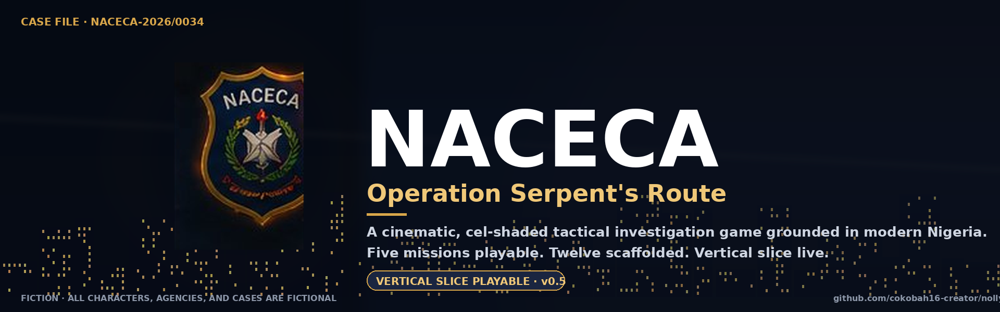

<p align="center">
  
</p>

# NACECA — Operation Serpent's Route

A cinematic, cel-shaded, third-person tactical-investigation game grounded in modern Nigeria. Web build (Three.js · r128) — runs in any modern browser, no install.

> Vertical slice playable: HQ briefing · Lagos market patrol · Lekki mansion raid · Benin Bypass checkpoint · Ozalla forest shrine. Twelve-mission campaign scaffolded.

---

## Quick start

**Just play it:** open `naceca.html` in any browser. That's the single-file build — no server, no install, runs offline.

**Develop:** open `index.html` from a static webserver (`python3 -m http.server 8080`) so the bundle loads cleanly. Then edit any module under `src/` and run `python3 build.py` to regenerate `naceca.html`.

---

## Deploy to GitHub Pages

This repo is structured to drop straight into [github.com/cokobah16-creator/nollywood-media](https://github.com/cokobah16-creator/nollywood-media) as a `naceca/` subfolder. Pushed to `main`, it goes live at:

```
https://cokobah16-creator.github.io/nollywood-media/naceca/naceca.html
```

The first time you set this up:

1. **Push the folder** to your repo at `nollywood-media/naceca/`. Make sure `.nojekyll` is included — without it, GitHub Pages runs Jekyll, which silently filters out files starting with underscores (including `src/_bundle.js`) and the game won't load.
2. **Enable Pages** in your repo settings: `Settings → Pages → Source: Deploy from a branch → main / (root)`.
3. **First load takes ~5–15 s** — the music payload (~25 MB) streams as needed; the bundle itself is 1.4 MB and loads instantly.

The `.nojekyll` file at the root of this folder is what lets the underscore-prefixed bundle file work. Don't delete it.

**Sharing the demo.** Once live, the URL above works in any pitch deck, LinkedIn post, grant application, or partner email. The single-file `naceca.html` is also shareable as a download — drop it on any static host, or send it directly (the music won't load from a downloaded HTML, but the game still plays with synth audio).

---

## Repo layout

```
/
├── naceca.html              ← single-file build (ship this)
├── index.html               ← dev entry — loads styles.css + src/_bundle.js
├── styles.css               ← UI / HUD / overlay styles
├── build.py                 ← bundles src/ → src/_bundle.js → naceca.html
├── encode_assets.py         ← encodes PNGs in src/assets/ into _inline.js (base64)
├── .nojekyll                ← tells GitHub Pages to skip Jekyll (preserves _bundle.js)
├── docs/
│   └── hero.png             ← README hero banner
├── assets/
│   └── music/               ← 13 MP3s copied here by build.py for hosting
└── src/
    ├── _HEADER.js           ← module banner
    ├── main.js              ← post-boot wiring placeholder
    │
    ├── assets/              ← rendered character portraits + title badge
    │   ├── _inline.js       ← auto-generated base64-encoded asset module
    │   ├── portraits/       ← dialogue panel character art (256×256 PNG)
    │   └── title/           ← cinematic title-screen art
    │
    ├── config/              ← static data (no logic)
    │   ├── missions.js
    │   ├── skills.js
    │   ├── dialogue.js
    │   ├── puzzles.js
    │   ├── casefile.js
    │   └── evidence_board.js
    │
    ├── systems/             ← engine + gameplay systems
    │   ├── state.js         ← S — single source of truth for game state
    │   ├── state_save.js    ← localStorage save / load / erase
    │   ├── util.js          ← clamp, $, $$, toast, refreshHUD, etc.
    │   ├── audio.js         ← Web Audio API — synthesised SFX + ambient
    │   ├── engine.js        ← Three.js init, post-processing, scene utils,
    │   │                      player & NPC builders, atmosphere ticks
    │   ├── dialogue_system.js
    │   ├── puzzle_system.js
    │   ├── evidence.js
    │   ├── mission_flow.js  ← loadMission, beginMission, scene routing
    │   ├── aftermath.js     ← branching headlines, post-mission screens
    │   ├── mission_select.js
    │   ├── skill_tree.js
    │   ├── evidence_board.js ← Tab-key corkboard — drag-link investigation
    │   ├── pause.js
    │   └── boot.js          ← window.onload entry, menu wiring
    │
    └── scenes/              ← 3D scene builders
        ├── _common.js       ← newScene, addGround, addTree, etc.
        ├── hq.js            ← Lagos NACECA HQ briefing room
        ├── market.js        ← Ikeja street market (mission 2)
        ├── mansion.js       ← Lekki cybercrime mansion (mission 3, night)
        ├── checkpoint.js    ← Benin Bypass joint op (mission 4, dusk)
        ├── shrine.js        ← Ozalla forest shrine (mission 5, dawn)
        └── asaba.js         ← Asaba commercial warehouse (mission 6)
```

---

## Asset pipeline

Character portraits and the title-screen badge live as PNGs in `src/assets/portraits/` and `src/assets/title/`. They get base64-encoded into `src/assets/_inline.js` by `python3 encode_assets.py` and folded into the bundle by `python3 build.py` — so the single-file `naceca.html` stays self-contained and runs offline, no external image fetches.

**Portrait map.** The dialogue system in `src/systems/dialogue_system.js` exposes a `PORTRAIT_MAP` that pairs each in-game speaker key with an asset filename. To swap a portrait, drop a 256×256 PNG into `src/assets/portraits/` and add an entry to that map.

**Procedural fallback.** If a portrait asset isn't found, `drawPortrait()` falls back to the original SVG silhouette so the game still runs from the modular source (`index.html`) even when the asset bundle hasn't been built.

---

## Music

Thirteen cinematic tracks (Suno-generated, ~25 MB total) live as MP3 files in `src/assets/music/`. They are **not** inlined — too large for the single-file build to absorb. `build.py` copies the music folder next to `naceca.html` so the deliverable folder is self-contained when hosted.

**Variants.** Most cues have two alternate tracks (Suno's v1/v2 generations) — the music system picks one randomly per browser session, so every playthrough sounds slightly different. The pick is cached for the session so a track doesn't switch mid-mission.

| Cue | Variants | Used for |
|---|---|---|
| `title` | `title.mp3` · `title_alt.mp3` | Main menu / title screen |
| `ambient_lagos` | `ambient_lagos.mp3` · `_alt.mp3` | HQ briefing (M1) · Lagos market (M2) — chill afrobeat |
| `stealth` | `stealth.mp3` · `_alt.mp3` | Mansion raid (M3) · Checkpoint (M4) · Asaba breach (M6) |
| `investigation` | `investigation.mp3` · `_alt.mp3` | Forest shrine (M5, low) · Evidence Board overlay |
| `victory` | `victory.mp3` · `_alt.mp3` | Mission-complete aftermath / headline screen |
| `trailer` | `trailer.mp3` · `_alt.mp3` | Reserved (cinematic intro / promo) |
| `chase` | _(single 16 s stinger)_ | M6 — fires when the runner breaks for the loading bay |

Music routes through `audio.js` `playMusic(name, opts)` with linear-ramp fade-ins/outs and cross-fades. Master gain still controls volume. If the music folder is absent, the game falls back to synth audio + ambient beds with no errors.

**Adding a track or variant.** Drop the MP3 into `src/assets/music/`, then either add a new entry in the `MUSIC` catalog in `audio.js` or append the URL to an existing variant array.

---

## Adding a new mission

1. Add a row to `src/config/missions.js` (`MISSIONS` array). Set `playable: true` when ready.
2. Add scene builder `src/scenes/<name>.js` — function `buildScene<Name>(){ ... }`.
3. Wire it into `src/systems/mission_flow.js` `beginMission()` — set objectives, evidence cap, ambient bed, call your scene builder.
4. (Optional) Add dialogue scripts to `src/config/dialogue.js`.
5. (Optional) Add headline branches to `src/systems/aftermath.js` `generateHeadline()`.
6. Add the new file to `LOAD_ORDER` in `build.py`.
7. Run `python3 build.py`.

---

## Reputation system

Every choice shifts three meters:

| Meter | What it tracks | Raise it | Lower it |
|---|---|---|---|
| **Integrity** | Lawful procedure | Knock-and-announce, civilian protection | Force, bribery, planted evidence |
| **Public Trust** | Citizen / press perception | De-escalation, child rescue | Bystander harm, perceived corruption |
| **Agency Favour** | Command + political backers | High-profile arrests, fast ops | Disobeying orders, exposing patrons |

Headlines, dialogue branches, mission availability, and ending paths all key off these.

---

## Evidence Board

Press <kbd>Tab</kbd> in any mission to open the corkboard. Twelve cards (suspects, evidence, locations) pinned with red strings. Click two to draw a link. Correct links raise INTEL; wrong ones cost 3.

| INTEL | Unlock |
|---|---|
| ≥ 50 | Warrant approved |
| ≥ 70 | Suspect counts revealed |
| ≥ 80 | Hidden caches mapped |
| ≥ 90 | Behavior prediction |

---

## Controls

| Key | Action |
|---|---|
| WASD / Arrows | Move |
| Shift | Sprint |
| C | Crouch |
| E | Interact |
| F | Scan (highlights evidence) |
| Tab | Evidence Board |
| K | Skill tree |
| Esc | Pause |
| Space | Advance dialogue |

---

## Tech stack

- **3D:** Three.js r128, custom toon shading + inverted-hull outlines, custom post-processing fragment shader (bloom, vignette, chromatic aberration, film grain, color grade)
- **Audio:** Web Audio API — fully synthesised, zero asset files
- **UI:** DOM overlays · Oswald + Inter + JetBrains Mono
- **Storage:** localStorage for save / load / mission progress
- **Build:** Python (`build.py`) bundles modules into one HTML file

The single-file `naceca.html` runs offline from `file://` — important constraint that's preserved by the build.

---

## Status

| Mission | Region | Status |
|---|---|---|
| 01 — HQ Briefing | Lagos | ✅ Playable |
| 02 — Market Patrol | Lagos · Ikeja | ✅ Playable |
| 03 — Operation Night Raid | Lagos · Lekki | ✅ Playable |
| 04 — Checkpoint Shakedown | Edo · Benin Bypass | ✅ Playable |
| 05 — Forest Shrine Compound | Edo · Ozalla | ✅ Playable |
| 06 — The Disappeared | Delta · Asaba | 🟨 Scaffolded |
| 07 — No Signal Zone | Edo · Ugbowo | 🟨 Scaffolded |
| 08 — Oba's Palace Raid | Edo · Benin | 🟨 Scaffolded |
| 09 — The Ritual Market | Delta · Sapele | 🟨 Scaffolded |
| 10 — Forest Pursuit | Delta · Wetlands | 🟨 Scaffolded |
| 11 — Debrief Dilemma | Lagos · NACECA HQ | 🟨 Scaffolded |
| 12 — Final Standoff | Delta · Riverbank | 🟨 Scaffolded |

---

## License & disclaimers

NACECA is a **fictional agency**. All characters, organisations, agencies, and cases in this work are fictional. The game is a portfolio piece — not affiliated with any real agency, party, individual, or commercial venture.

© 2026 · Kristopher C. Okobah · part of the [nollywood-media](https://github.com/cokobah16-creator/nollywood-media) portfolio.
